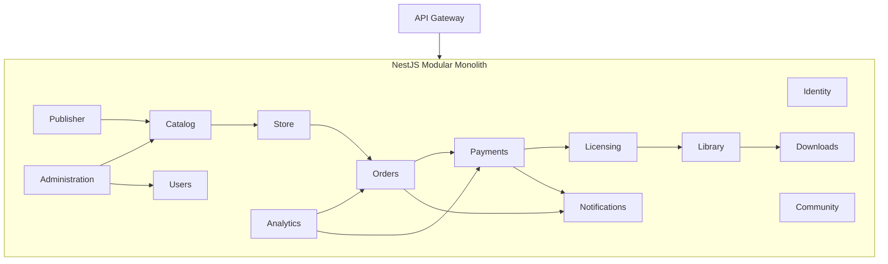
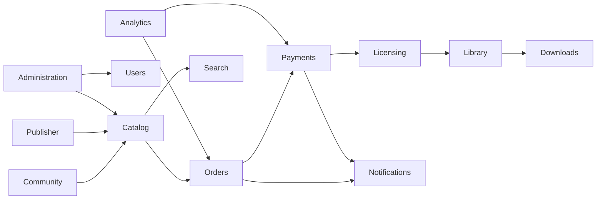

# Project Atlas - C4 Model Level 3: Component Diagram

Version: 1.0

---

# 1. Introduction

## Purpose

This document describes the internal components of the Project Atlas backend.

The backend is implemented as a **Modular Monolith** using NestJS.

Each business module is autonomous and follows:

- Domain-Driven Design (DDD)
- Clean Architecture
- SOLID Principles
- Dependency Inversion

Modules communicate through application services and domain events rather than direct access to another module's persistence layer.

---

# 2. High-Level Component Diagram



---

# 3. Internal Module Structure

Every module follows exactly the same architecture.

```text
Module

├── Presentation Layer
│
├── Application Layer
│
├── Domain Layer
│
└── Infrastructure Layer
```

---

# 4. Presentation Layer

Responsibilities

- REST Controllers
- Authentication Guards
- Validation
- DTO Mapping

Contains

- Controllers
- Guards
- Interceptors
- Pipes
- Exception Filters

Never contains business logic.

---

# 5. Application Layer

Responsibilities

- Execute Use Cases
- Coordinate business operations
- Publish domain events
- Manage transactions

Contains

- Commands
- Command Handlers
- Queries
- Query Handlers
- DTOs
- Application Services

Depends only on the Domain Layer.

---

# 6. Domain Layer

Responsibilities

Contains the business rules.

Contains

- Entities
- Value Objects
- Aggregates
- Domain Events
- Repository Interfaces
- Domain Services
- Specifications

The Domain Layer must not depend on NestJS, Prisma, PostgreSQL, or any infrastructure.

---

# 7. Infrastructure Layer

Responsibilities

Implements technical concerns.

Contains

- Prisma Repositories
- Redis
- RabbitMQ
- Email Provider
- S3 Storage
- External APIs

Implements repository interfaces defined in the Domain Layer.

---

# 8. Identity Module

Responsibilities

- Registration
- Login
- Logout
- JWT
- Refresh Tokens
- OAuth
- MFA

Presentation

- Auth Controller

Application

- Login Use Case
- Register Use Case
- Refresh Token Use Case

Domain

- User Credentials
- Session
- Token

Infrastructure

- JWT Provider
- Password Hasher
- OAuth Providers

---

# 9. User Module

Responsibilities

- Profiles
- Preferences
- Avatar
- Account Settings

---

# 10. Catalog Module

Responsibilities

- Products
- Categories
- Tags
- Pricing
- Media
- Builds

Application Services

- Create Product
- Update Product
- Publish Product

---

# 11. Store Module

Responsibilities

- Search
- Wishlist
- Cart
- Discounts

Use Cases

- Add To Cart
- Remove From Cart
- View Store
- Search Products

---

# 12. Orders Module

Responsibilities

- Checkout
- Orders
- Invoices

Use Cases

- Create Order
- Cancel Order
- View History

Publishes

- OrderCreated
- CheckoutStarted

---

# 13. Payments Module

Responsibilities

- Payment Processing
- Refunds
- Transactions

Consumes

- CheckoutStarted

Publishes

- PaymentCompleted
- PaymentFailed
- RefundApproved

---

# 14. Licensing Module

Responsibilities

- Ownership
- License Generation
- Validation

Consumes

- PaymentCompleted

Publishes

- LicenseGenerated

---

# 15. Library Module

Responsibilities

- Owned Products
- Installation History
- Download History

Consumes

- LicenseGenerated

Publishes

- ProductAddedToLibrary

---

# 16. Downloads Module

Responsibilities

- Download Authorization
- Download Tokens
- CDN Access

Consumes

- ProductAddedToLibrary

---

# 17. Community Module

Responsibilities

- Reviews
- Ratings
- Friends
- Activity Feed

Use Cases

- Submit Review
- Edit Review
- Add Friend

---

# 18. Publisher Module

Responsibilities

- Product Submission
- Build Upload
- Pricing
- Sales Reports

Use Cases

- Create Product
- Upload Build
- Schedule Release

---

# 19. Notification Module

Responsibilities

- Email
- Push Notifications
- In-App Notifications

Consumes

- UserRegistered
- PaymentCompleted
- RefundApproved
- ProductPublished

---

# 20. Administration Module

Responsibilities

- Moderation
- User Management
- Refund Approval
- Audit

---

# 21. Analytics Module

Responsibilities

- Sales Reports
- Product Statistics
- Revenue
- Platform Metrics

Consumes

Almost every domain event.

---

# 22. Shared Components

## Event Bus

Responsibilities

- Publish Domain Events
- Dispatch Events

Initially

NestJS EventEmitter

Future

RabbitMQ / Kafka

---

## Cache Manager

Responsibilities

- Product Cache
- User Cache
- Session Cache

Technology

Redis

---

## File Storage

Responsibilities

- Images
- Videos
- Game Builds

Technology

S3 / MinIO

---

## Scheduler

Responsibilities

- Release Products
- Send Emails
- Cleanup Tasks

Technology

NestJS Scheduler

---

# 23. Component Relationships



---

# 24. Dependency Rules

Allowed

Presentation

↓

Application

↓

Domain

↓

Infrastructure

Forbidden

Infrastructure

↓

Presentation

Forbidden

Domain

↓

Infrastructure

Forbidden

Application

↓

Presentation

---

# 25. Cross-Cutting Components

Shared across all modules.

Authentication

Authorization

Logging

Validation

Caching

Configuration

Exception Handling

Metrics

Tracing

Audit Logging

---

# 26. Internal Communication

Current

Direct Application Services

+

Domain Events

Future

Asynchronous Events

RabbitMQ

Kafka

No module accesses another module's database directly.

---

# 27. Component Evolution

Current

```
Modular Monolith
```

↓

Future

```
Identity Service

Catalog Service

Order Service

Payment Service

Library Service

Download Service

Notification Service

Analytics Service
```

Each module is designed to become an independent deployable service without changing the business model.

---

# 28. Quality Goals

Each component should satisfy:

- High Cohesion
- Low Coupling
- Independent Testing
- Clear Ownership
- Single Responsibility
- Explicit Interfaces
- Event-Driven Collaboration
- Infrastructure Independence
