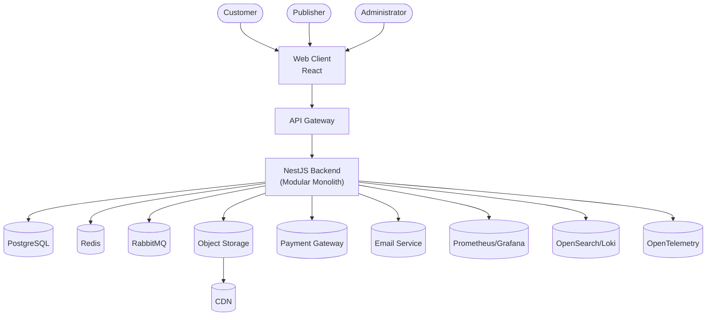

# Project Atlas - C4 Model Level 2: Container Diagram

Version: 1.0

---

# 1. Introduction

## Purpose

This document describes the major deployable containers that compose Project Atlas.

A **container** is an independently deployable or executable application or data store. It is **not** a Docker container.

This document defines:

- Applications
- Databases
- Infrastructure
- External services
- Communication paths

---

# 2. Architecture Overview

Project Atlas follows a layered architecture:

```
Clients
    │
    ▼
API Gateway / Reverse Proxy
    │
    ▼
Backend Application (NestJS Modular Monolith)
    │
    ├──────── PostgreSQL
    ├──────── Redis
    ├──────── RabbitMQ
    ├──────── Object Storage
    └──────── Observability Stack
```

---

# 3. Containers

## 3.1 Web Client

### Technology

- React
- TypeScript
- Vite
- TailwindCSS

### Responsibilities

- User Interface
- Product Browsing
- Authentication
- Store
- Library
- Publisher Dashboard
- Administration

Communicates using HTTPS.

---

## 3.2 API Gateway

### Technology

Initially:

- Nginx

Future:

- Kong
- Traefik
- Envoy

Responsibilities

- HTTPS termination
- Routing
- Rate limiting
- Authentication forwarding
- Compression
- Logging

---

## 3.3 Backend Application

### Technology

NestJS

Architecture

Modular Monolith

Responsibilities

- Business Logic
- Authentication
- Product Catalog
- Store
- Orders
- Payments
- Library
- Downloads
- Notifications
- Administration

Internal modules communicate through well-defined interfaces.

---

## 3.4 PostgreSQL

Purpose

Primary transactional database.

Stores

- Users
- Products
- Orders
- Licenses
- Payments
- Reviews
- Audit Logs

Characteristics

- ACID compliant
- Relational
- Normalized schema

---

## 3.5 Redis

Purpose

In-memory data store.

Responsibilities

- Cache
- Sessions
- Rate Limiting
- Temporary Tokens
- Hot Product Cache

---

## 3.6 RabbitMQ

Purpose

Asynchronous messaging.

Used For

- Notifications
- Emails
- Analytics
- Background Jobs

Future

Can be replaced with Kafka if event volume increases.

---

## 3.7 Object Storage

Technology

Amazon S3

or

MinIO

Stores

- Game Builds
- Images
- Videos
- Product Media

---

## 3.8 CDN

Responsibilities

- Deliver downloads
- Deliver patches
- Deliver screenshots

Examples

- Cloudflare
- CloudFront

---

## 3.9 Email Service

Responsibilities

- Verification Emails
- Password Reset
- Purchase Confirmation
- Refund Notifications

---

## 3.10 Payment Gateway

Examples

- Stripe
- PayPal
- Regional Providers

Responsibilities

- Payment Authorization
- Capture
- Refunds

---

## 3.11 Monitoring Stack

Technology

- Prometheus
- Grafana

Responsibilities

- Metrics
- Dashboards
- Alerts

---

## 3.12 Logging Stack

Technology

- OpenSearch
- Elasticsearch
- Loki

Responsibilities

- Centralized Logs
- Search
- Diagnostics

---

## 3.13 Tracing

Technology

OpenTelemetry

Responsibilities

- Distributed Tracing
- Performance Analysis

---

# 4. Container Diagram



---

# 5. Communication Matrix

| Source | Target | Protocol |
|---------|---------|----------|
| Browser | API Gateway | HTTPS |
| Gateway | Backend | HTTP |
| Backend | PostgreSQL | SQL |
| Backend | Redis | RESP |
| Backend | RabbitMQ | AMQP |
| Backend | Storage | S3 API |
| Backend | Payment Gateway | HTTPS |
| Backend | Email Service | HTTPS / SMTP |
| CDN | Object Storage | HTTPS |

---

# 6. Backend Internal Modules

The backend contains the following modules:

- Identity
- Users
- Catalog
- Store
- Orders
- Payments
- Licensing
- Library
- Downloads
- Community
- Publisher
- Notifications
- Administration
- Analytics

Each module owns:

- Business logic
- Validation
- Repositories
- Events
- DTOs

Modules communicate through application services and domain events rather than direct database access.

---

# 7. Deployment Strategy

## Development

- Docker Compose
- Single PostgreSQL instance
- Single Redis instance
- Single RabbitMQ instance

---

## Staging

- Kubernetes
- Managed PostgreSQL
- Managed Redis
- MinIO
- Monitoring enabled

---

## Production

- Kubernetes
- PostgreSQL High Availability
- Redis Cluster
- RabbitMQ Cluster
- Multi-AZ Object Storage
- CDN
- Auto Scaling

---

# 8. Scalability Strategy

Initially:

```
1 Backend Instance
```

↓

```
Multiple Backend Instances
```

↓

```
API Gateway

↓

Backend x N

↓

Shared PostgreSQL

↓

Redis

↓

RabbitMQ
```

↓

Future

```
API Gateway

↓

Identity Service

Catalog Service

Order Service

Payment Service

Library Service

Download Service

Notification Service
```

No frontend changes are required because the external API remains stable.

---

# 9. Security

- HTTPS everywhere
- JWT authentication
- OAuth2 support
- RBAC authorization
- Secrets stored outside source code
- Database encryption
- Secure cookies
- Rate limiting
- Input validation

---

# 10. Availability

The platform should support:

- Rolling deployments
- Automatic restarts
- Health checks
- Readiness probes
- Liveness probes
- Backup and recovery
- Zero or minimal downtime deployments

---

# 11. Design Decisions

### Why a Modular Monolith?

- Easier development
- Easier debugging
- Simpler transactions
- Lower operational complexity
- Faster iteration

### Why RabbitMQ?

- Background processing
- Decoupled communication
- Easy migration to event-driven architecture

### Why PostgreSQL?

- ACID compliance
- Rich indexing
- JSON support
- Strong ecosystem

### Why Redis?

- Low latency
- Caching
- Session storage
- Distributed locking

---

# 12. Related Documents

- C4 Context Diagram
- C4 Component Diagram
- Domain Model
- Bounded Contexts
- Event Storming
- Deployment Architecture
