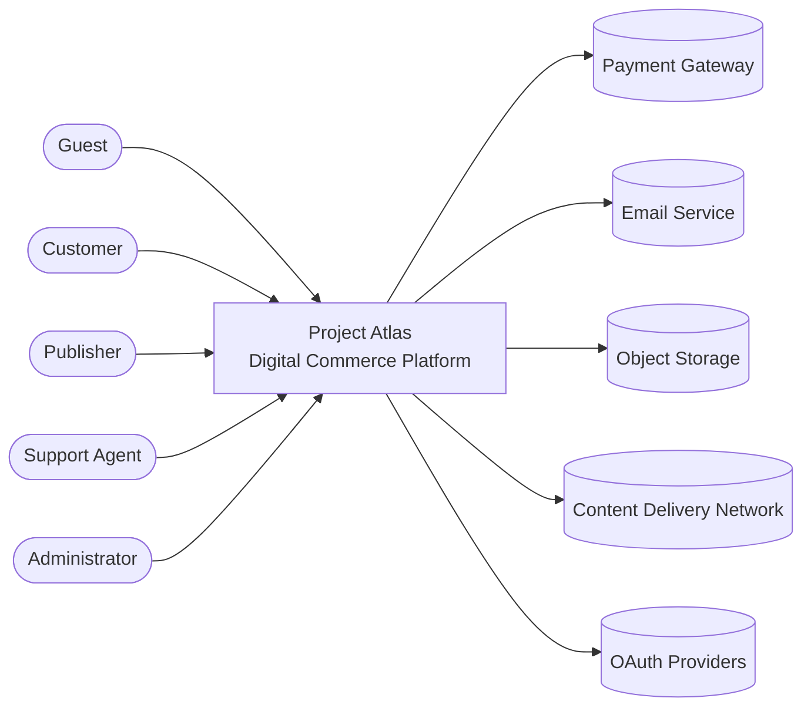

# Project Atlas - C4 Model Level 1: System Context

Version: 1.0

---

# 1. Introduction

## Purpose

This document describes the **System Context** of Project Atlas using the C4 Model (Level 1).

The System Context Diagram provides a high-level view of the platform, showing:

- Primary users
- External systems
- System boundary
- Interactions between participants

At this level, Project Atlas is treated as a single system.

---

# 2. System Overview

Project Atlas is a distributed digital commerce platform that enables customers to discover, purchase, download, and manage digital products while allowing publishers to distribute and maintain their products.

The platform serves as an intermediary between customers, publishers, administrators, and external service providers.

---

# 3. Primary Actors

## Customer

Description

A registered user who purchases and manages digital products.

Responsibilities

- Register an account
- Authenticate
- Browse products
- Purchase products
- Download owned products
- Submit reviews
- Manage library
- Request refunds

---

## Guest

Description

A visitor without an account.

Responsibilities

- Browse products
- Search products
- View product details
- Create an account

---

## Publisher

Description

An organization or individual that distributes products through the platform.

Responsibilities

- Create products
- Upload builds
- Configure pricing
- Schedule releases
- View sales analytics

---

## Support Agent

Description

Platform staff responsible for customer assistance.

Responsibilities

- Handle support requests
- Process refunds
- Resolve account issues

---

## Administrator

Description

Responsible for platform management.

Responsibilities

- Manage users
- Moderate products
- Configure platform
- View reports
- Monitor platform health

---

# 4. External Systems

## Payment Gateway

Purpose

Processes financial transactions.

Examples

- Stripe
- PayPal
- Local payment providers

Interactions

- Authorize payments
- Capture payments
- Process refunds

---

## Email Service

Purpose

Delivers transactional emails.

Examples

- Verification emails
- Password reset
- Purchase confirmations

---

## Object Storage

Purpose

Stores static assets.

Examples

- Game builds
- Images
- Videos
- Product media

---

## Content Delivery Network (CDN)

Purpose

Distributes downloadable content globally.

Responsibilities

- Deliver game files
- Deliver updates
- Deliver patches

---

## OAuth Providers

Purpose

External authentication.

Examples

- Google
- GitHub
- Microsoft
- Discord

---

# 5. System Responsibilities

Project Atlas is responsible for:

- Identity management
- Authorization
- Product catalog
- Shopping cart
- Orders
- Payments
- Digital licensing
- User libraries
- Download authorization
- Community features
- Publisher portal
- Administration
- Notifications
- Analytics

---

# 6. Context Diagram

---

# 7. Interaction Summary

| Actor / System | Interaction |
|----------------|-------------|
| Guest | Browse products, register |
| Customer | Purchase, download, manage library |
| Publisher | Publish and manage products |
| Support Agent | Process support cases and refunds |
| Administrator | Operate and configure the platform |
| Payment Gateway | Payment processing |
| Email Service | Transactional email delivery |
| Object Storage | Asset storage |
| CDN | File delivery |
| OAuth Providers | External authentication |

---

# 8. System Boundary

Project Atlas includes:

- Authentication
- User Management
- Product Catalog
- Store
- Orders
- Payments
- Licensing
- Library
- Downloads
- Community
- Publisher Portal
- Notifications
- Administration
- Analytics

The following systems are outside the platform boundary:

- Payment providers
- Email providers
- OAuth providers
- CDN
- Object storage

---

# 9. Design Principles

The platform is designed to:

- Separate business logic from external services.
- Integrate with external providers through stable interfaces.
- Minimize coupling with third-party systems.
- Support future replacement of external services with minimal changes.
- Provide a consistent experience regardless of the underlying provider.

---

# 10. Quality Attributes

The architecture emphasizes:

- Scalability
- Reliability
- Security
- Maintainability
- Modularity
- Extensibility
- Observability
- High availability

---

# 11. Future Evolution

The current context diagram represents Project Atlas as a single logical system.

In future phases, the internal structure will evolve into:

- Modular Monolith (Phase 1)
- Distributed Modular Architecture (Phase 2)
- Event-Driven Microservices (Phase 3)

The external interactions shown in this document will remain stable while the internal implementation evolves.

---

# 12. Related Documents

- Vision Document
- Business Model
- Requirements
- Domain Model
- Bounded Contexts
- Event Storming
- C4 Container Diagram (Level 2)
