# Project Atlas - Entity Relationship Diagram (ERD)

Version: 1.0

---

# 1. Purpose

This document defines the conceptual and logical data model for Project Atlas.

The ERD is organized by bounded context to improve readability and maintainability.

Each bounded context owns its own entities and relationships.

The diagrams are implementation-independent but are designed for PostgreSQL.

---

# 2. ERD Organization

| Section | Description |
|----------|-------------|
| Overview | High-level platform relationships |
| Identity | Authentication and authorization |
| Users | User profiles |
| Catalog | Products and metadata |
| Store | Cart and wishlist |
| Orders | Purchasing |
| Payments | Financial transactions |
| Licensing | Digital ownership |
| Library | Owned products |
| Community | Reviews and friends |
| Publisher | Product management |
| Notifications | User notifications |
| Administration | Audit and moderation |
| Analytics | Reporting |

---

# 3. Platform Overview

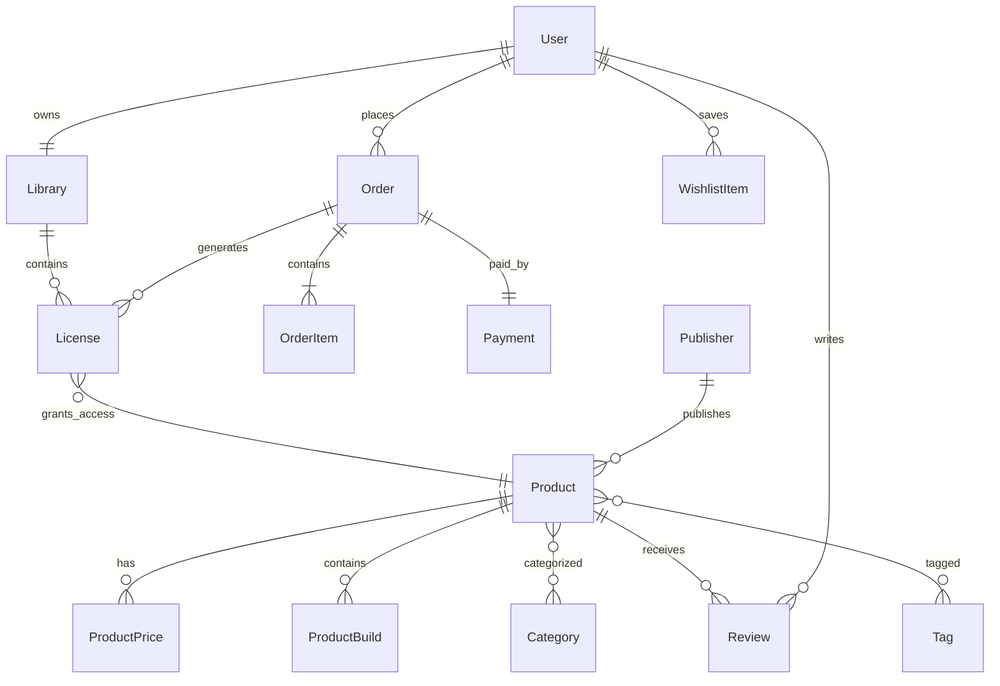

---

# 4. Identity Context

Entities

- UserCredential
- Session
- RefreshToken
- Role
- Permission
- UserRole
- RolePermission

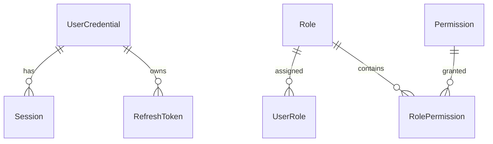

---

# 5. User Context

Entities

- User
- UserProfile
- UserPreference
- Avatar

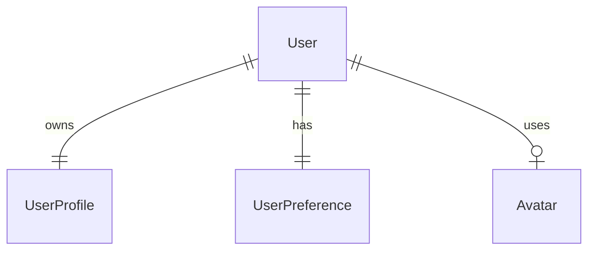

---

# 6. Catalog Context

Entities

- Product
- Publisher
- ProductPrice
- Category
- Tag
- ProductCategory
- ProductTag
- ProductBuild
- MediaAsset
- ProductLanguage
- SystemRequirement

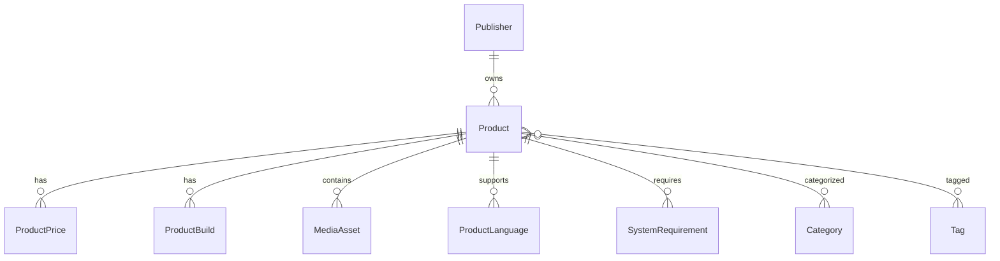

---

# 7. Store Context

Entities

- Cart
- CartItem
- Wishlist
- WishlistItem

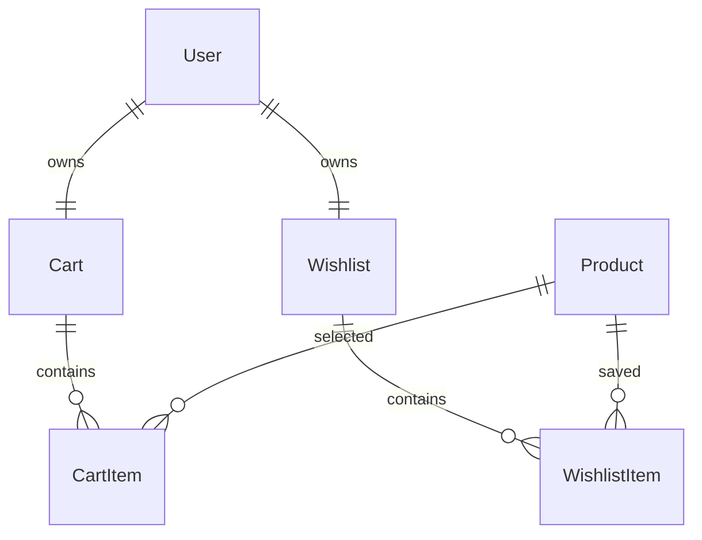

---

# 8. Orders Context

Entities

- Order
- OrderItem
- Invoice

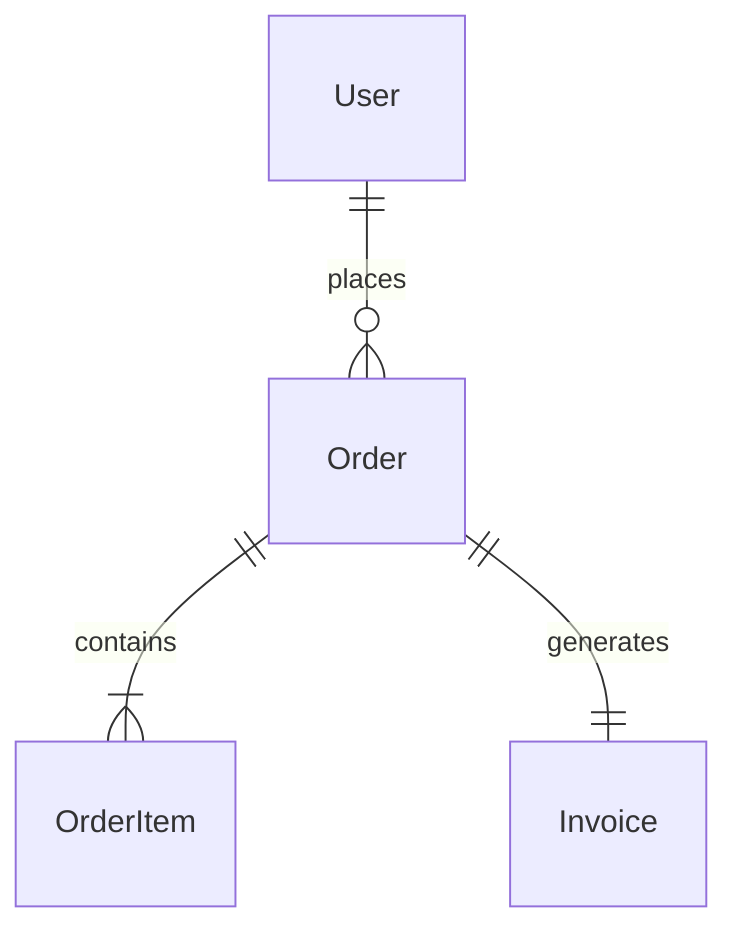

---

# 9. Payments Context

Entities

- Payment
- PaymentMethod
- Refund
- Transaction

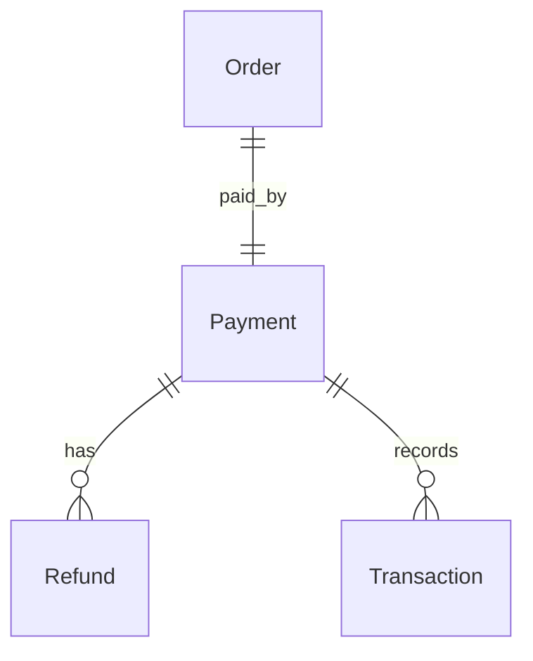

---

# 10. Licensing Context

Entities

- License

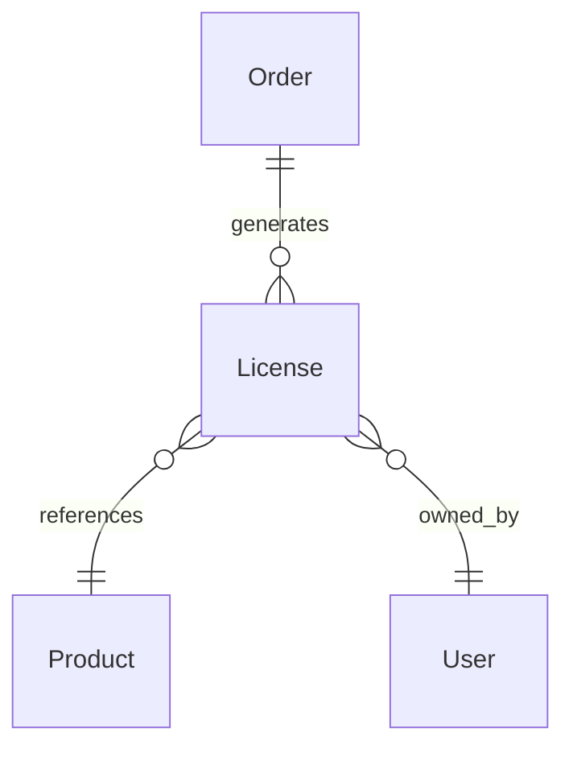

---

# 11. Library Context

Entities

- Library
- LibraryItem
- Installation
- DownloadHistory

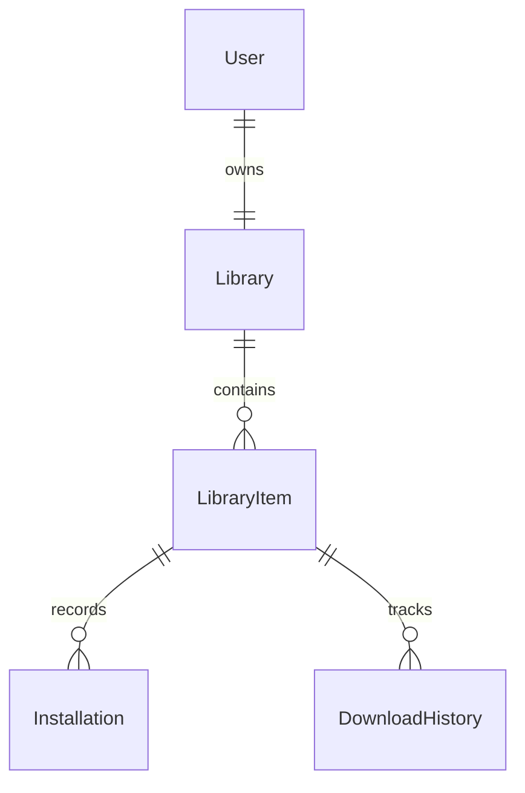

---

# 12. Community Context

Entities

- Review
- Friend
- FriendRequest

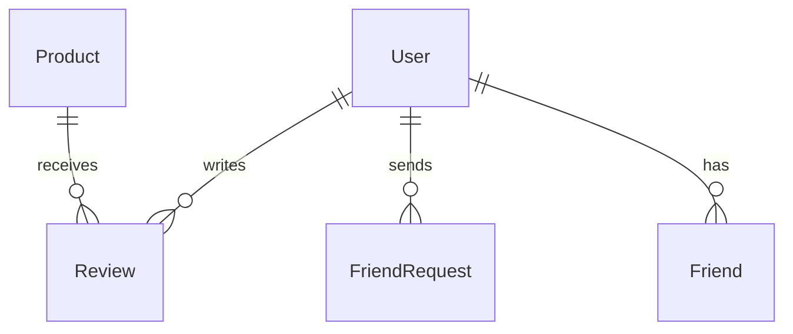

---

# 13. Publisher Context

Entities

- Publisher
- PublisherMember
- ProductSubmission
- ReleaseSchedule

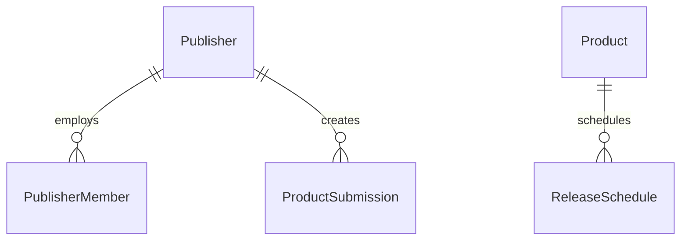

---

# 14. Notification Context

Entities

- Notification
- NotificationTemplate
- NotificationDelivery

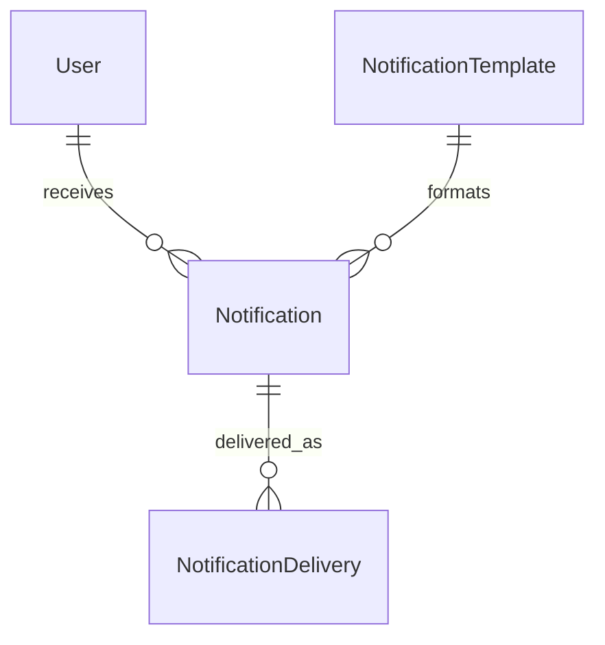

---

# 15. Administration Context

Entities

- AuditLog
- ModerationCase
- ModerationAction

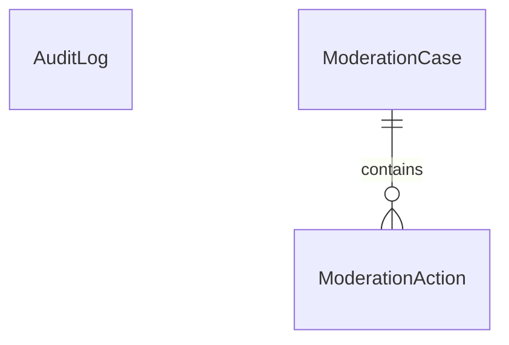

---

# 16. Analytics Context

Entities

- SalesSnapshot
- ProductStatistics
- RevenueSummary

Analytics data is derived from operational data and should not be the source of truth.

---

# 17. Relationship Rules

- One User owns one Library.
- One Publisher owns many Products.
- One Product has many Builds.
- One Order contains many Order Items.
- One Payment belongs to one Order.
- One License belongs to one User and one Product.
- One User may write one Review per Product.
- Products may belong to many Categories and Tags.
- A Cart belongs to exactly one User.
- A Wishlist belongs to exactly one User.

---

# 18. Next Step

This ERD defines conceptual relationships.

The following document (`database-schema.md`) will define:

- Tables
- Columns
- Data types
- Primary keys
- Foreign keys
- Constraints
- Indexes
- Partitioning
- Naming conventions
